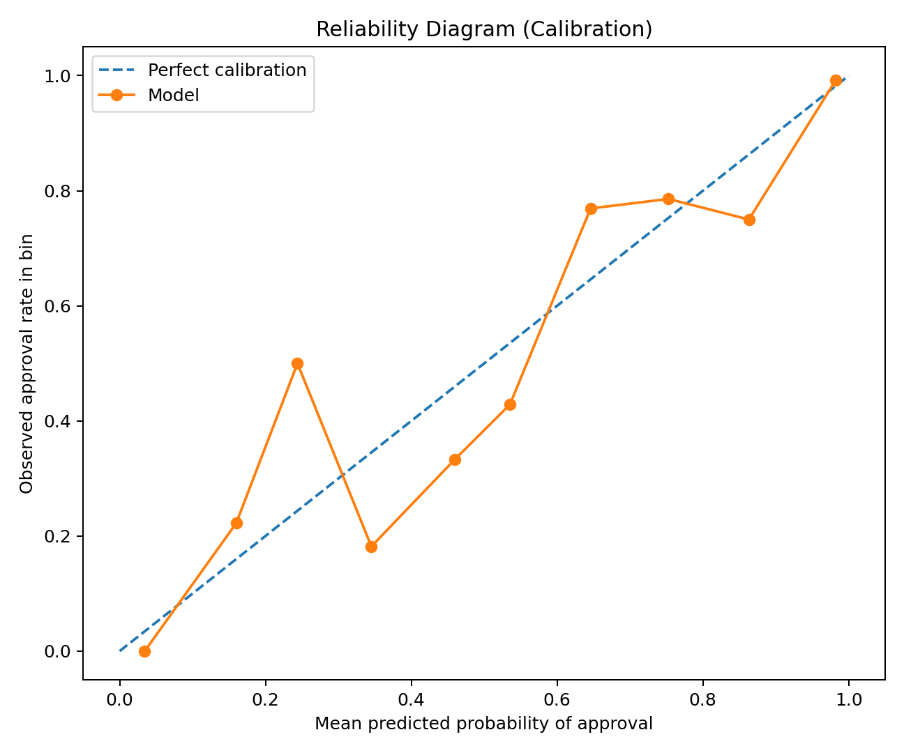
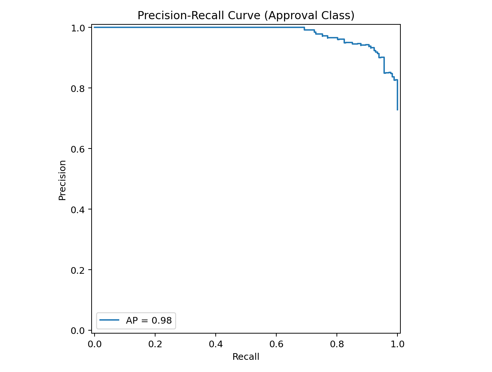
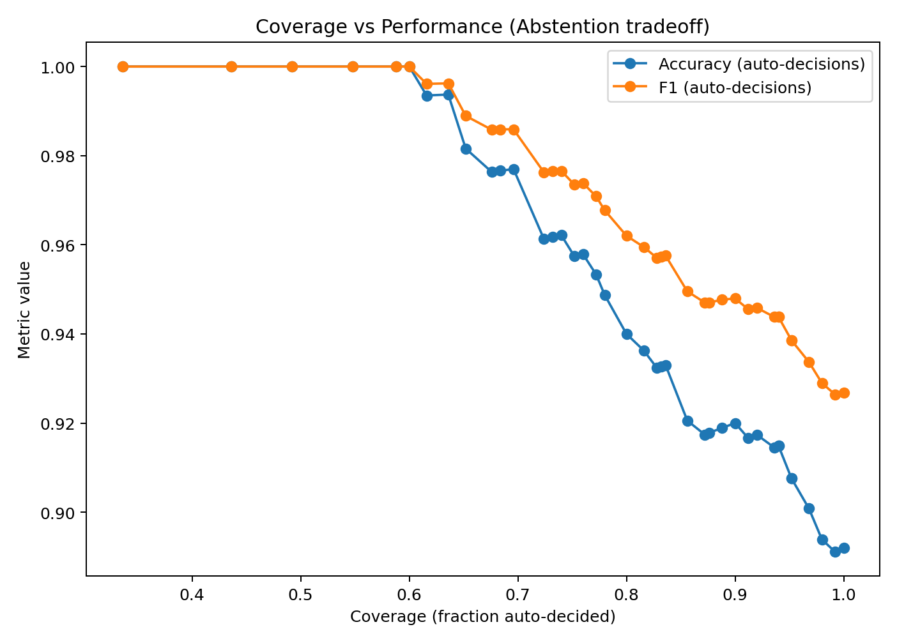
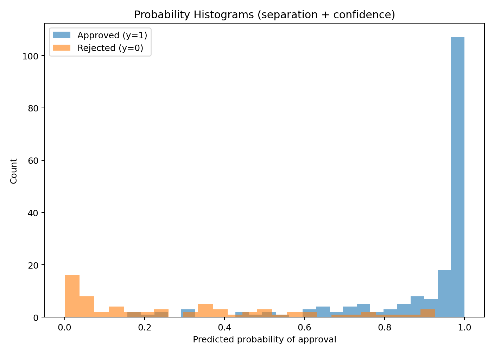
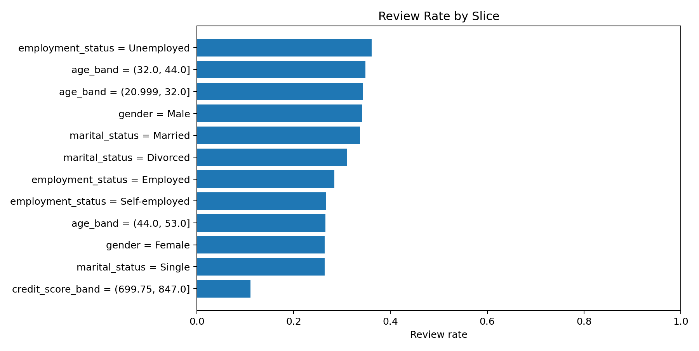
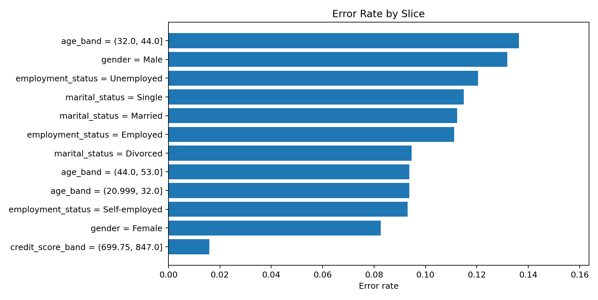
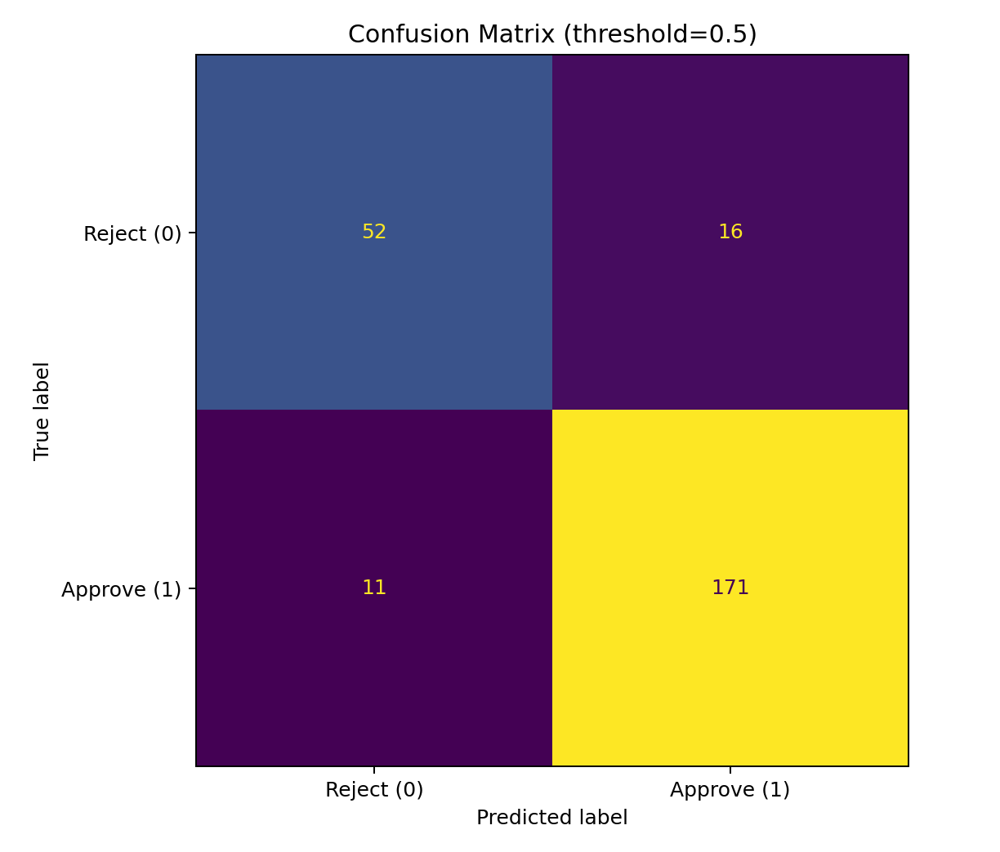

<div align="center">
    
# Underwriting Decision Safety Lab


[](https://github.com/AmirhosseinHonardoust/Underwriting-Decision-Safety-Lab/actions/workflows/ci.yml)

</div>

A production-minded underwriting decision-safety workflow for turning loan-approval model scores into **calibrated probabilities**, **abstention policies**, **coverage-quality tradeoffs**, **slice safety diagnostics**, and **human-review decisions**.

> **Important:** This project is a **portfolio and research demo**, not a production underwriting or credit-decision system.
>
> The model, thresholds, policy variants, and slice reports are designed to demonstrate a professional decision-safety workflow. They should not be used for real lending, credit approval, or automated financial decisions without legal, compliance, fairness, security, and domain review.

---

## Table of Contents

- [Project Overview](#project-overview)
- [What This Project Does](#what-this-project-does)
- [What This Project Does Not Do](#what-this-project-does-not-do)
- [Key Features](#key-features)
- [System Workflow](#system-workflow)
- [Project Structure](#project-structure)
- [Installation](#installation)
- [Quick Start](#quick-start)
- [Training and Evaluation](#training-and-evaluation)
- [Abstention and Policy Variants](#abstention-and-policy-variants)
- [Slice Safety Reporting](#slice-safety-reporting)
- [Streamlit Dashboard](#streamlit-dashboard)
- [Evaluation Metrics](#evaluation-metrics)
- [Visual Reports](#visual-reports)
- [Testing and CI](#testing-and-ci)
- [Code Quality](#code-quality)
- [Limitations](#limitations)
- [Responsible Use](#responsible-use)
- [Future Improvements](#future-improvements)
- [Tech Stack](#tech-stack)
- [Author](#author)
- [License](#license)

---

## Project Overview

Underwriting is not only a classification problem. In a real decision workflow, a model score is useful only if it can support a defensible action:

- approve automatically
- reject automatically
- route uncertain cases to human review
- monitor decision quality across applicant slices
- communicate uncertainty and limitations clearly

This project demonstrates an end-to-end underwriting decision-safety workflow using a loan-approval dataset. It includes data validation, model training, calibrated probability estimation, abstention policy selection, policy variants, slice-level safety reporting, visual diagnostics, and a Streamlit dashboard for triage and review.

The goal is to show how a loan-approval model can be turned into a **decision-support system**, not just a single accuracy or AUC score.

---

## What This Project Does

This project can:

- Load and validate a loan-approval CSV dataset
- Train a calibrated loan-approval model using a scikit-learn pipeline
- Evaluate accuracy, F1, ROC-AUC, PR-AUC, Brier score, and ECE
- Compare the model against simple baselines
- Build a coverage curve for abstention-based decision safety
- Recommend a threshold for auto-decision versus review routing
- Generate multiple policy variants for different review strategies
- Produce test predictions with confidence and review routing
- Generate data-quality diagnostics
- Generate slice-level safety reports across applicant groups
- Visualize reliability, probability distributions, coverage tradeoffs, and slice diagnostics
- Save model and policy artifacts
- Provide a Streamlit dashboard for report review and triage
- Run automated tests and CI smoke workflows

---

## What This Project Does Not Do

This project does **not**:

- Make real credit decisions
- Provide financial, legal, or lending advice
- Guarantee fairness, compliance, or deployability
- Replace underwriters, compliance teams, or model-risk review
- Use a production lending dataset
- Provide real-time underwriting infrastructure
- Include live monitoring, drift detection, or retraining automation
- Certify that the model is safe for high-stakes deployment

A production underwriting system would need stronger governance, access control, audit logging, fairness review, monitoring, adverse-action compliance, explainability review, and expert validation.

---

## Key Features

- **Calibrated probability model** for loan approval decisions
- **Corrected Expected Calibration Error** based on observed positive-class rate
- **Reliability diagram** for probability-quality inspection
- **Abstention policy** to route uncertain cases to human review
- **Coverage-quality curve** for automation tradeoff analysis
- **Policy variants** for target coverage, quality-first, high-coverage, balanced, and conservative-review strategies
- **Baseline comparisons** for majority, empirical-prior, and stratified-random strategies
- **PR-AUC and Brier score** for probability and imbalanced-decision evaluation
- **Data validation** for schema, target, numeric features, categorical features, and underwriting plausibility checks
- **Slice safety reporting** for review rate, error rate, calibration, and auto-decision behavior across applicant groups
- **Streamlit dashboard** for report card, coverage, triage, data quality, and slice safety review
- **Unit tests and GitHub Actions CI**
- **Generated outputs and visual reports** for reproducible review

---

## System Workflow

```text
Loan approval dataset
        ↓
Data validation and quality checks
        ↓
Train/test split
        ↓
Preprocessing + calibrated model pipeline
        ↓
Probability metrics and baseline comparisons
        ↓
Coverage curve and abstention policy
        ↓
Policy variants and decision-support artifacts
        ↓
Slice safety reporting
        ↓
Dashboard triage and review
```

---

## Project Structure

```text
Underwriting-Decision-Safety-Lab/
│
├── .github/
│   └── workflows/
│       └── ci.yml
│
├── app/
│   └── app.py
│
├── data/
│   └── raw/
│       └── loanapproval.csv
│
├── outputs/
│   ├── abstention_policy.json
│   ├── baseline_metrics.json
│   ├── coverage_curve.csv
│   ├── data_quality.json
│   ├── evaluation_summary.json
│   ├── metrics_overall.json
│   ├── model_card.html
│   ├── model.joblib
│   ├── policy_card.md
│   ├── policy_variants.json
│   ├── run_manifest.json
│   ├── slice_report.csv
│   ├── slice_report.json
│   ├── slice_summary.json
│   └── test_predictions.csv
│
├── reports/
│   └── figures/
│       ├── confusion_matrix.png
│       ├── coverage_vs_performance.png
│       ├── precision_recall_curve.png
│       ├── probability_histograms.png
│       ├── reliability_diagram.png
│       ├── slice_error_rates.png
│       └── slice_review_rates.png
│
├── underwriting/
│   ├── __init__.py
│   ├── _typing.py
│   ├── abstention.py
│   ├── calibration.py
│   ├── data.py
│   ├── evaluation.py
│   ├── modeling.py
│   ├── model_card.py
│   ├── pipeline.py
│   ├── plots.py
│   ├── slices.py
│   ├── synthetic.py
│   ├── triage.py
│   └── validation.py
│
├── tests/
│   ├── test_abstention.py
│   ├── test_calibration.py
│   ├── test_evaluation_improvements.py
│   ├── test_pipeline_contracts.py
│   ├── test_project_integrity.py
│   ├── test_slice_reporting.py
│   └── test_validation.py
│
├── .gitignore
├── .pre-commit-config.yaml
├── CHANGELOG.md
├── CONTRIBUTING.md
├── README.md
├── pyproject.toml
├── requirements.txt
├── requirements-dev.txt
└── LICENSE
```

---

## Installation

### 1. Clone the Repository

```bash
git clone https://github.com/AmirhosseinHonardoust/Underwriting-Decision-Safety-Lab.git
cd Underwriting-Decision-Safety-Lab
```

### 2. Create a Virtual Environment

On Windows CMD:

```cmd
python -m venv .venv
.venv\Scripts\activate
```

On macOS/Linux:

```bash
python -m venv .venv
source .venv/bin/activate
```

### 3. Install Requirements

```bash
pip install -r requirements.txt
```

Optionally install the project as a package to get the `underwriting-pipeline`
command:

```bash
pip install -e .
```

---

## Quick Start

No dataset on hand? Generate a synthetic one with the production schema and run
the whole pipeline with zero external data:

```bash
python -m underwriting.synthetic --out data/raw/synthetic.csv --rows 1000 --seed 0
python -m underwriting.pipeline --input data/raw/synthetic.csv --target-coverage 0.70
```

Run the full local workflow:

```bash
python -m underwriting.pipeline --input data/raw/loanapproval.csv --target-coverage 0.70
```

After an editable install, the same workflows are available as commands:

```bash
underwriting-generate-data --out data/raw/synthetic.csv --rows 1000 --seed 0
underwriting-pipeline --input data/raw/loanapproval.csv --target-coverage 0.70
```

Launch the dashboard:

```bash
streamlit run app/app.py
```

---

## Training and Evaluation

The main pipeline trains the underwriting model, calibrates probabilities, evaluates the model, generates coverage and policy artifacts, and writes figures.

```bash
python -m underwriting.pipeline \
  --input data/raw/loanapproval.csv \
  --out-dir outputs \
  --figures-dir reports/figures \
  --target-coverage 0.70
```

Generated evaluation outputs include:

```text
outputs/metrics_overall.json
outputs/baseline_metrics.json
outputs/evaluation_summary.json
outputs/coverage_curve.csv
outputs/abstention_policy.json
outputs/policy_variants.json
outputs/test_predictions.csv
outputs/model.joblib
outputs/model_card.html
outputs/run_manifest.json
reports/figures/reliability_diagram.png
reports/figures/precision_recall_curve.png
reports/figures/coverage_vs_performance.png
reports/figures/confusion_matrix.png
```

`model_card.html` is a single, self-contained report (figures embedded as base64)
summarizing headline metrics, the recommended decision policy, baselines, slice
safety, all diagnostic figures, and run provenance &mdash; shareable as one file.

`run_manifest.json` records run provenance — input SHA-256, row count, the
`random_state` and policy config, and Python/library versions — so any run can be
traced back to its exact inputs and environment. It is environment-specific and
not expected to be byte-identical across machines.

---

## Abstention and Policy Variants

A model does not need to auto-decide every application. This project uses an abstention policy to route uncertain applications to review.

The recommended policy is saved in:

```text
outputs/abstention_policy.json
```

Example recommended policy from the included run:

<div align="center">

| Field | Value |
|---|---|
| Recommended threshold | 0.852 |
| Expected auto-decision coverage | 0.696 |
| Expected auto-decision accuracy | 0.977 |
| Expected auto-decision F1 | 0.986 |
| Target coverage | 0.700 |

</div>

Policy variants are saved in:

```text
outputs/policy_variants.json
```

Policy variants include:

<div align="center">

| Policy | Purpose |
|---|---|
| `target_coverage` | Chooses the threshold closest to the requested auto-decision coverage |
| `quality_first` | Prioritizes very high auto-decision quality with lower coverage |
| `high_coverage` | Maximizes automation coverage while accepting lower quality |
| `balanced` | Balances auto-decision accuracy and F1 |
| `conservative_review` | Sends more applications to review by requiring very high confidence |

</div>

> These policies are decision-support artifacts, not automated lending rules.

---

## Slice Safety Reporting

The project generates slice-level diagnostics to help inspect whether review rates, error rates, and calibration differ across applicant groups.

Slice artifacts are saved in:

```text
outputs/slice_report.csv
outputs/slice_report.json
outputs/slice_summary.json
```

The slice report includes diagnostics such as:

<div align="center">

| Diagnostic | Meaning |
|---|---|
| Observed approval rate | Actual approval rate inside a slice |
| Mean predicted approval probability | Average model score for the slice |
| Auto-decision rate | Share of cases auto-decided by the policy |
| Review rate | Share of cases routed to review |
| Auto-decision accuracy | Accuracy among auto-decided cases |
| Error rate | Overall slice error rate |
| False approval rate | Rejected cases incorrectly predicted as approved |
| False rejection rate | Approved cases incorrectly predicted as rejected |
| ECE by slice | Calibration error within the slice when enough rows exist |

</div>

Example slice summary from the included run:

<div align="center">

| Metric | Value |
|---|---|
| Number of slices | 20 |
| Max auto-decision-rate gap | 0.381 |
| Max error-rate gap | 0.145 |
| Max ECE gap | 0.087 |
| Small-slice count | 0 |

</div>

> Slice diagnostics are monitoring and review tools, not fairness certification.

---

## Streamlit Dashboard

Launch the app:

```bash
streamlit run app/app.py
```

The dashboard includes tabs for:

- report card
- coverage curve
- triage UI
- data quality
- slice safety
- notes and limitations

The dashboard helps review:

- overall model quality
- calibration behavior
- coverage versus performance
- recommended policy threshold
- applicant-level review routing
- data-quality checks
- slice-level review and error patterns

---

## Evaluation Metrics

The evaluation layer includes metrics designed for calibrated underwriting decision workflows.

<div align="center">

| Metric | Why it matters |
|---|---|
| Accuracy | Overall decision correctness at the default decision rule |
| F1 | Balance between positive-class precision and recall |
| ROC-AUC | Ranking quality across thresholds |
| Average precision / PR-AUC | Useful for positive-class ranking quality |
| Brier score | Measures probability quality |
| ECE | Measures calibration error between predicted probability and observed approval rate |
| Coverage | Share of applications auto-decided instead of reviewed |
| Auto-decision accuracy | Accuracy on the subset the policy auto-decides |

</div>

Example results from the included run:

<div align="center">

| Metric | Example value |
|---|---|
| Accuracy | 0.892 |
| F1 | 0.927 |
| ROC-AUC | 0.949 |
| Average precision / PR-AUC | 0.981 |
| Brier score | 0.080 |
| ECE | 0.051 |
| Recommended coverage | 0.696 |
| Auto-decision accuracy | 0.977 |

</div>

> These values are from a demo dataset and should not be interpreted as real-world underwriting performance.

---

## Visual Reports

### Model evaluation charts

<div align="center">

| Reliability Diagram | Precision-Recall Curve |
|---|---|
|  |  |
| **Analysis:** The reliability diagram compares predicted approval probabilities against observed approval rates. This matters because underwriting policies depend on calibrated probabilities, not only ranking quality. | **Analysis:** The precision-recall curve helps inspect positive-class performance and complements ROC-AUC when approval/rejection classes are not equally important. |

</div>

### Coverage and decision behavior

<div align="center">

| Coverage vs Performance | Probability Histograms |
|---|---|
|  |  |
| **Analysis:** The coverage curve shows the tradeoff between automation rate and quality. Higher thresholds route more cases to review but improve the reliability of auto-decisions. | **Analysis:** Probability histograms show how approval and rejection cases are distributed across model scores, helping diagnose separation and uncertainty. |

</div>

### Slice safety charts

<div align="center">

| Slice Review Rates | Slice Error Rates |
|---|---|
|  |  |
| **Analysis:** Review-rate differences show whether some applicant slices are routed to human review more often than others. | **Analysis:** Error-rate differences help identify slices where the model may need closer monitoring or additional validation. |

</div>

<details>
<summary>Additional confusion matrix</summary>

<div align="center">



The confusion matrix gives a compact view of correct and incorrect predictions at the default decision rule.

</div>

</details>

---

## Testing and CI

Run unit tests locally:

```bash
python -m unittest discover -s tests -v
```

Compile source files:

```bash
python -m compileall underwriting app tests
```

Set up the development tools (linting, formatting, type checking, coverage, hooks):

```bash
pip install -r requirements.txt -r requirements-dev.txt
pre-commit install            # optional: run the gate on every commit
```

Run the quality gate locally (matches CI):

```bash
ruff check underwriting app tests
black --check underwriting app tests
mypy
interrogate underwriting
coverage run --source=underwriting -m unittest discover -s tests && coverage report -m
```

The GitHub Actions workflow checks:

- linting (ruff), formatting (black), type checking (mypy with pandas-stubs)
- public-API docstring coverage (interrogate, 100%)
- dependency installation
- source compilation
- unit tests with coverage (90% overall, 80% per-file)
- full pipeline smoke workflow
- metrics artifact validation
- prediction schema validation
- coverage curve validation
- policy artifact validation
- slice report validation
- expected figure generation

CI is defined in:

```text
.github/workflows/ci.yml
```

---

## Code Quality

The project separates major responsibilities across modules:

<div align="center">

| Module | Purpose |
|---|---|
| `underwriting/data.py` | Loads data, infers schema, and creates data-quality summaries |
| `underwriting/validation.py` | Validates input schema, target, numeric columns, and plausibility checks |
| `underwriting/modeling.py` | Builds preprocessing and model pipeline, and prepares train/test splits |
| `underwriting/calibration.py` | Computes calibration bins and ECE |
| `underwriting/abstention.py` | Builds coverage curves and recommends abstention policies |
| `underwriting/evaluation.py` | Computes probability metrics, baselines, and policy variants |
| `underwriting/slices.py` | Generates slice-level safety reports |
| `underwriting/plots.py` | Generates diagnostic figures |
| `underwriting/pipeline.py` | Orchestrates the full workflow and writes the decision policy card |

</div>

---

## Limitations

This project has important limitations:

- The dataset is a demo dataset, not a production underwriting dataset
- The project is not a credit-decision engine
- Metrics do not prove real-world lending performance
- Slice diagnostics are not fairness certification
- The dashboard is not a secure underwriting platform
- No adverse-action notice workflow is included
- No live monitoring or drift detection is included
- No human-review audit log is included
- No regulatory compliance layer is included
- Policy variants are examples, not approved business rules

The project is strongest as a portfolio demonstration of calibrated decision-support workflow design.

---

## Responsible Use

This repository is intended for:

- learning about calibration and abstention
- demonstrating decision-safety workflows
- practicing underwriting model evaluation
- exploring coverage-quality tradeoffs
- reviewing slice-level diagnostics
- portfolio demonstration

It should not be used as-is for:

- real loan approval or rejection
- credit underwriting decisions
- automated high-stakes financial decisions
- regulatory compliance decisions
- adverse-action generation
- customer-facing lending workflows

Any real deployment would require expert review, monitoring, fairness analysis, legal review, compliance validation, security controls, and a human escalation process.

---

## Future Improvements

Potential next improvements:

- Add fairness metrics and group-specific calibration summaries
- Add adverse-action style reason codes
- Add stronger model card and data statement
- Add time-based validation and monitoring examples
- Add drift simulation
- Add FastAPI scoring endpoint
- Add Docker support
- Add audit-log style review workflow
- Add policy-threshold selector in the dashboard
- Add configurable cost and review-capacity assumptions
- Add confidence intervals for slice metrics
- Add model registry-style metadata

---

## Tech Stack

- Python
- pandas
- NumPy
- scikit-learn
- matplotlib
- Streamlit
- joblib
- unittest
- GitHub Actions

---

## Author

**Amir Honardoust**

GitHub: [@AmirhosseinHonardoust](https://github.com/AmirhosseinHonardoust)

---

## License

This project is intended for educational, research, and portfolio purposes.

If you use or modify this project, please keep the responsible-use notes and limitations clear.
